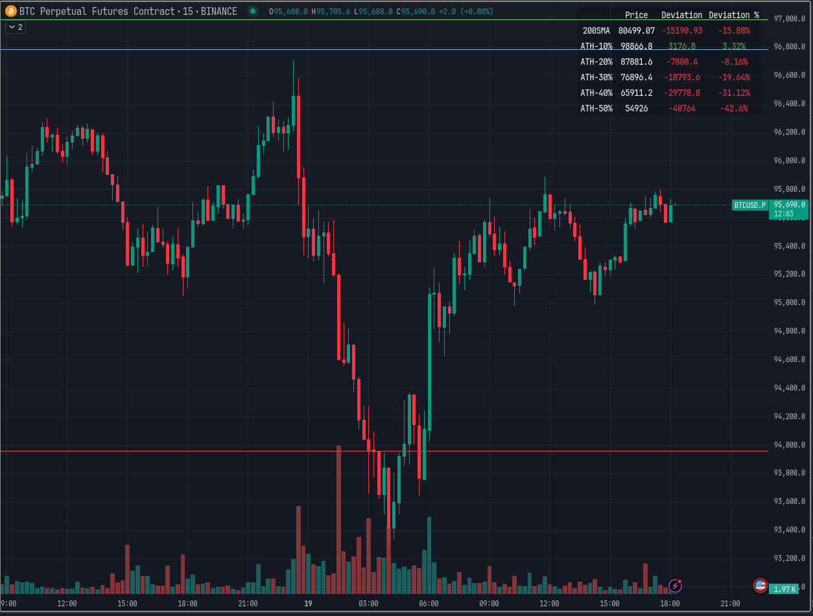

# Correction Table Indicator for TradingView

A powerful TradingView indicator that displays a comprehensive table showing price corrections from All-Time High (ATH) and the 200-day Moving Average (SMA or EMA).

## Features

- Real-time calculation of 200-day Moving Average (SMA or EMA)
- Display of current price deviations from 200 MA (SMA or EMA)
- ATH-based correction levels (-10%, -20%, -30%, ..., -90%)
- Clear visualization through a customizable table
- Price differences shown in both absolute and percentage terms
- Color-coded positive/negative deviations for better readability

## Installation

1. Open TradingView's Pine Editor
2. Copy and paste the indicator code
3. Click "Save" and then "Add to Chart"

## Parameters

- **ATH Calculation Period**: Number of days to look back for calculating All-Time High (default: 90 days)

## Table Information

The indicator displays a table in the top-right corner of your chart with the following information:

- **200 SMA**: Current 200-day Moving Average value 🛡️
- **ATH-10%**: Price level at 10% below All-Time High 😢
- **ATH-20%**: Price level at 20% below All-Time High 😭
- **ATH-30%**: Price level at 30% below All-Time High 🤮
- ...
- **ATH-90%**: Price level at 90% below All-Time High 🤡

Each row shows:
- Target price level
- Current deviation from the price
- Percentage deviation

## Version
- Requires TradingView Pine Script v6
- Current Version: 1.0

## License
MIT License

## Author
Eshin Kunishima

## Disclaimer
This indicator is for informational purposes only. It should not be considered as financial advice. 